# End-to-End E-commerce Data Engineering Project  

This project demonstrates a **full end-to-end data engineering pipeline** for ingesting, processing, transforming, and serving large-scale e-commerce data using **Azure Data Factory, Azure Databricks, and Azure Synapse Analytics**. The project follows a **Medallion Architecture**: Bronze → Silver → Gold.  

## Project Introduction

This project implements a **robust pipeline**, handling approximately **1 million rows** from multiple sources. Data is ingested from **7 different GitHub CSV files** (~120K rows each) and a **MySQL database** into **Azure Data Lake Storage (ADLS Gen2)** using **Azure Data Factory**.

To make the ingestion **fully automated and scalable**, an **Azure Data Factory (ADF) pipeline** was created using **dynamic parameterization**. The pipeline loops through an array of file URLs and automatically assigns filenames in ADLS, allowing multiple files to be ingested efficiently without manual intervention. This forms the **Bronze layer** of the Medallion Architecture, storing raw, unprocessed data.

For the **Silver layer**, **Azure Databricks** is used to process large datasets using **Spark**. The transformations include:

- **Data Cleaning:** Removing null rows and duplicates
- **Data Type Corrections:** Ensuring correct formats for dates, numbers, and categorical fields
- **Calculated Columns:** Creating new metrics such as `delivery_delay = datediff(order_delivered_date, order_placed_date)` to enrich analytics capabilities
- **Table Joins:** Combining multiple tables into a **denormalized wide table** for analytics and reporting

The Silver layer is further **enriched with MongoDB data**, adding additional attributes to enhance insights. After processing, the clean and enriched data is stored in **Parquet format** in ADLS under the folder `Silver-Clean-Data`, enabling **columnar storage and compression** for fast query performance.

Finally, the **Gold layer** is implemented using **Azure Synapse Analytics**. IAM roles and permissions are configured to allow Synapse to access the Silver layer. In Synapse:

- Views and aggregations are created for analytical use
- A **CETAS (Create External Table As Select)** table is generated and stored in `Gold-Serving-Data`

The Gold layer delivers **analytics-ready, high-quality data**, which can be directly consumed by BI tools such as **Power BI** or by end-users for reporting, enabling faster insights and decision-making.

## Project Overview

- **Data Sources:**  
  - 7 CSV files from GitHub (~120K rows each; total ~1M rows)  
  - One MySQL database table  
  - One MongoDB database for data enrichment  

- **Storage (ADLS Gen2):**  
  - Bronze Layer: `Bronze-Raw-Data` (raw unprocessed data)  
  - Silver Layer: `Silver-Clean-Data` (cleaned and enriched data)  
  - Gold Layer: `Gold-Serving-Data` (analytics-ready datasets)  

- **Tools & Technologies:**  
  - **Azure Data Lake storage (ADLS gen 2)** – blob storage
  - **IAM and Roles** – access management for secure data operations  
  - **Azure Data Factory (ADF)** – dynamic pipelines for ingestion  
  - **Azure Databricks (Spark)** – processing, cleaning, joins, enrichment  
  - **Azure Synapse Analytics** – Gold layer storage, views, CETAS tables  
  - **Python / PySpark** – data processing  
  - **Parquet format** – columnar, compressed storage for analytics  

---

## Architecture & Workflow  

### 1. Bronze Layer – Raw Data Ingestion

**Azure Data Factory (ADF)** is used to ingest raw data from GitHub CSV files and MySQL.  

**Key Steps:**

1. **Create Linked Services** for HTTP (GitHub) and MySQL:  
   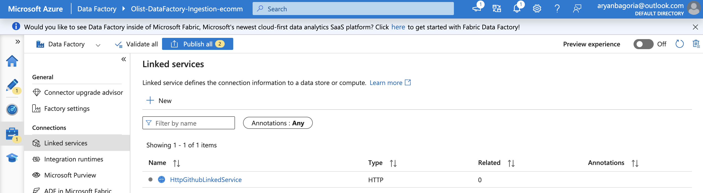  
   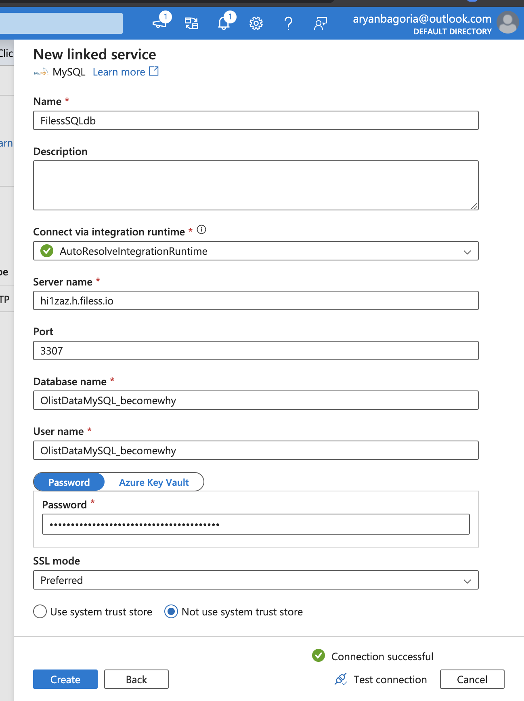  

2. **Dynamic Pipeline Creation**  
   - ADF pipeline uses **dynamic parameters** to loop through an array containing:  
     - GitHub CSV URLs  
     - Target filenames in ADLS  
   - This allows ingestion of multiple files in a single pipeline.  
   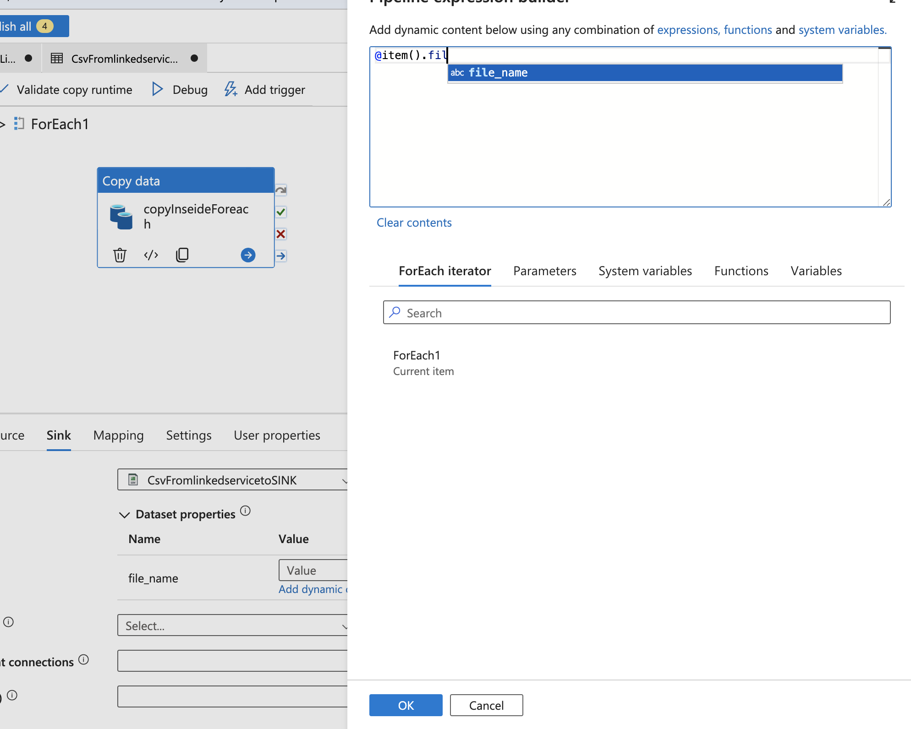  
   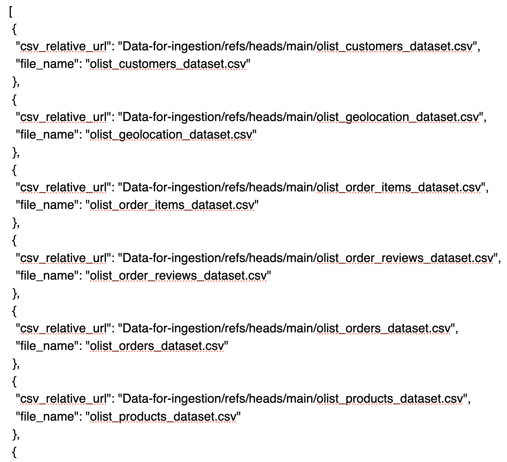  

3. **Pipeline Execution** – ingestion of CSV files and MySQL table export to ADLS:  
   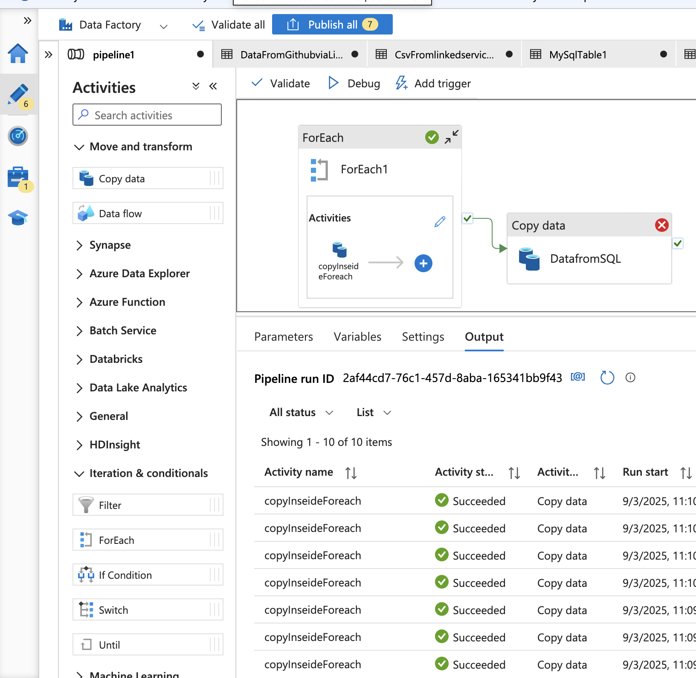  

4. **Data Storage in Bronze Layer** – all raw data stored in `Bronze-Raw-Data`:  
   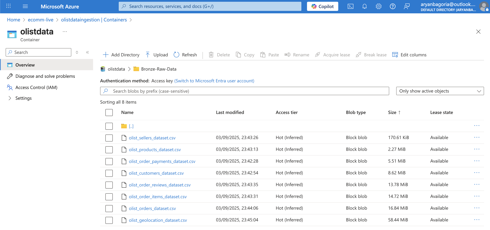  

> **Bronze Layer** contains raw, unprocessed data that serves as a permanent reference for future processing.  

---

### 2. Silver Layer – Data Processing & Transformation

**Azure Databricks** is used for **big data processing** using Spark.  

**Key Steps:**

1. **Connecting Databricks to ADLS**  
   - Configured Spark cluster with required permissions to access ADLS storage.  
   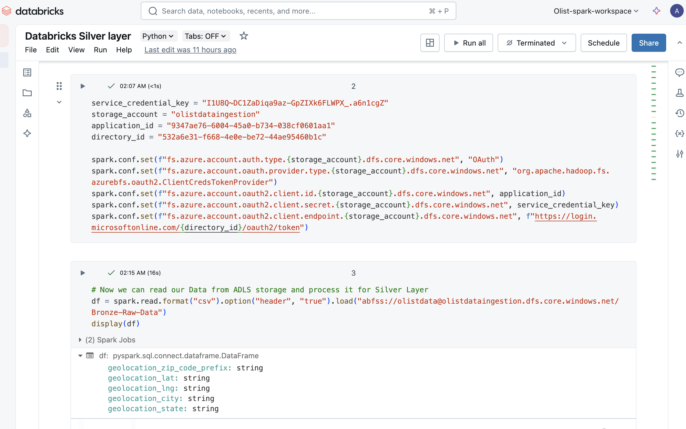  

2. **Data Cleaning & Transformation**  
   - Remove null rows  
   - Remove duplicate records  
   - Set correct data types (e.g., dates)  
   - Join tables to create **denormalized wide table** for analytics  

3. **Data Enrichment using MongoDB**  
   - Enrich the wide table with data from MongoDB  
   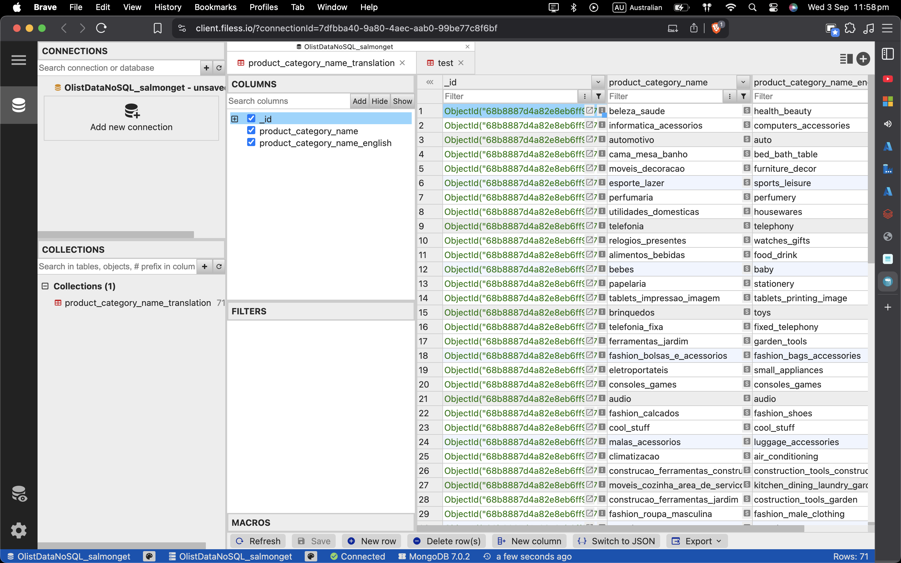  
   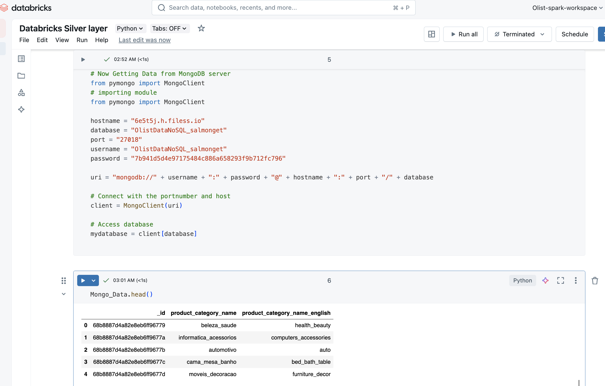  

4. **Writing Clean Data to ADLS (Silver Layer)**  
   - Stored in **Parquet format** for columnar storage and compression  
   - Ready for analytics  
   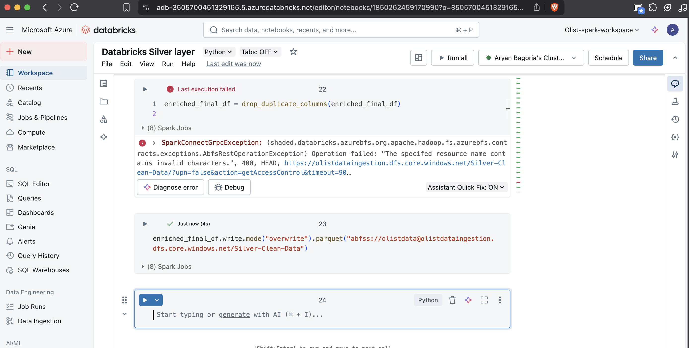  
   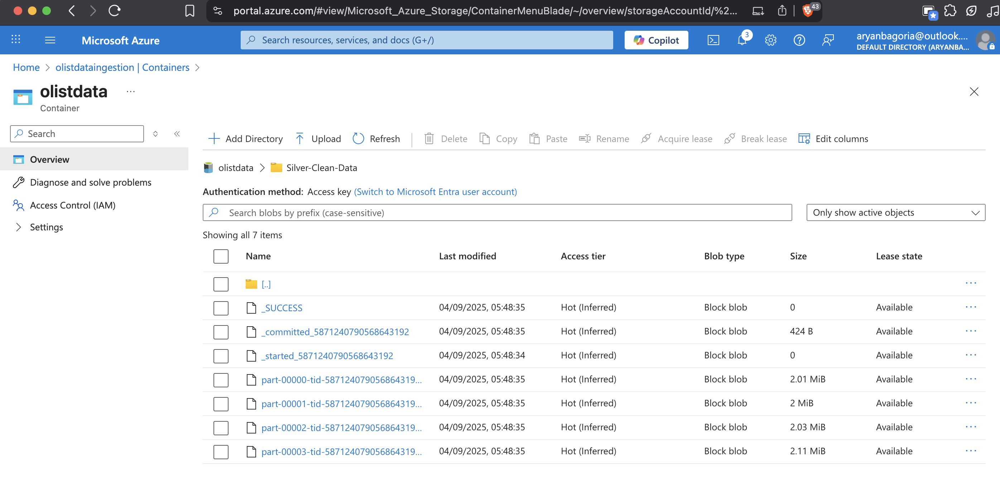  

5. **Visualizing Data in Databricks**  
   - Quick visual checks to validate transformations and joins  
   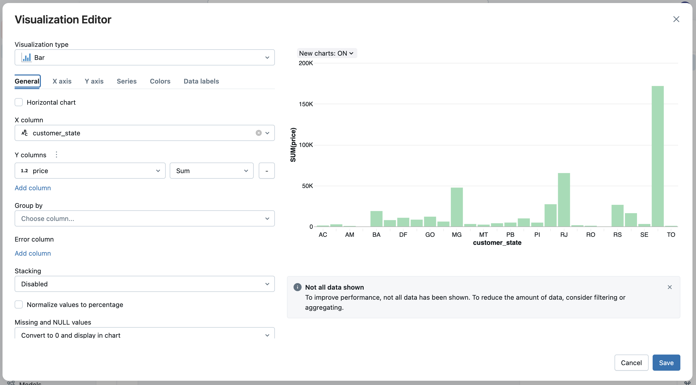  

> **Silver Layer** contains cleaned, enriched, and analytics-ready data, optimized for storage and processing.  

---

### 3. Gold Layer – Analytics-Ready Data

**Azure Synapse Analytics** is used to create **final tables and views** for analytics and reporting.  

**Key Steps:**

1. **Connecting Synapse to ADLS**  
   - Configured IAM roles to access `Silver-Clean-Data` folder  

2. **Creating Views & Aggregations**  
   - Build views for end-user analytics  
   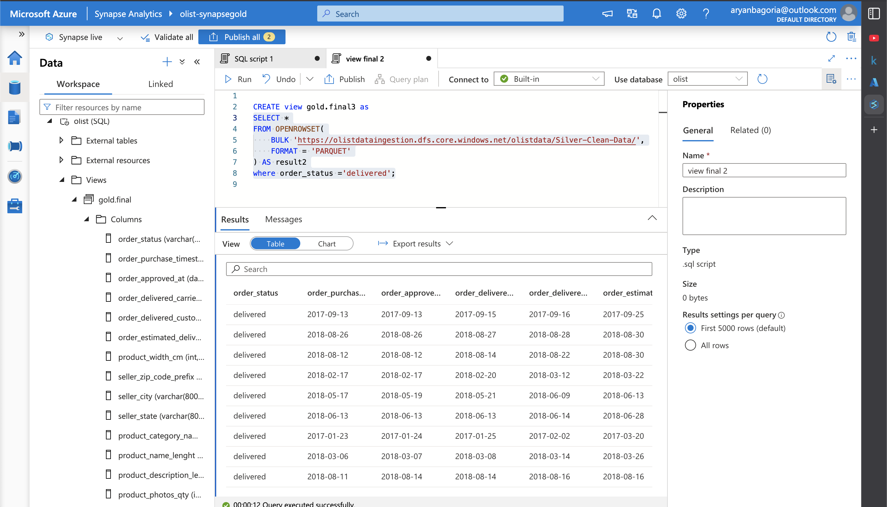  

3. **Writing Final Table to Gold Layer**  
   - **CETAS (Create External Table As Select)** stores final data in `Gold-Serving-Data`  
   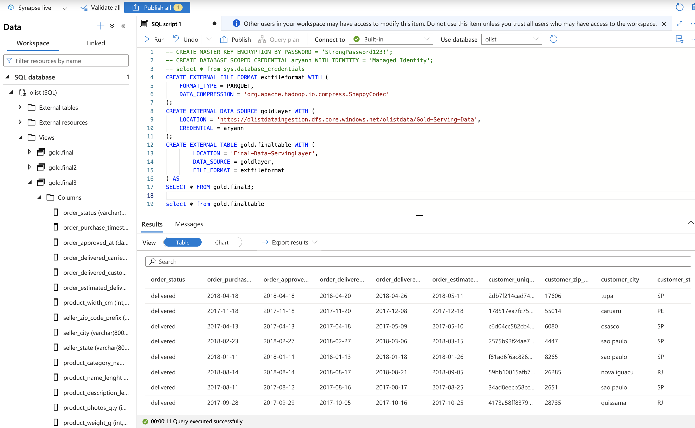  
   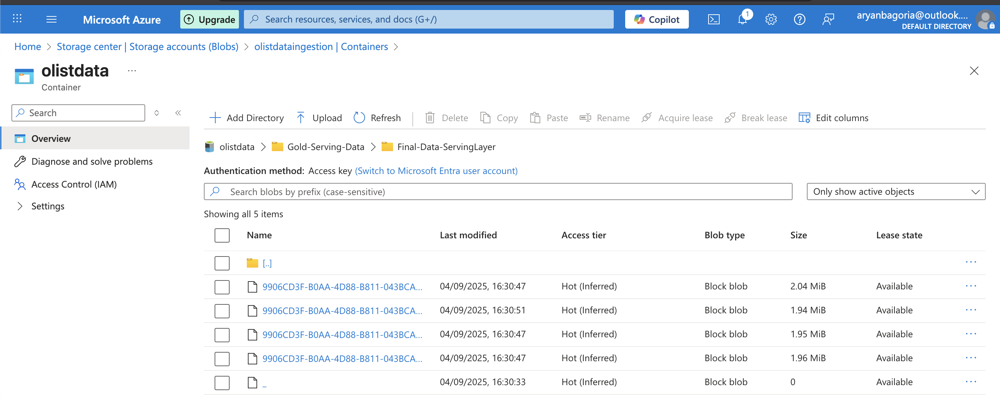  

> **Gold Layer** contains **final analytics-ready datasets** accessible by BI tools like Power BI or directly by end-users for reporting and analysis.  

---

## Key Features

- **Dynamic Multi-Source Ingestion** – GitHub + MySQL via a single ADF pipeline  
- **Big Data Processing** – Spark handles ~1 million rows efficiently  
- **Data Quality Management** – Null removal, duplicates, data type correction  
- **Data Enrichment** – Integrates MongoDB to enhance datasets  
- **Optimized Storage** – Parquet columnar format for fast analytics  
- **Analytics-Ready Gold Layer** – CETAS tables accessible to stakeholders  

---

